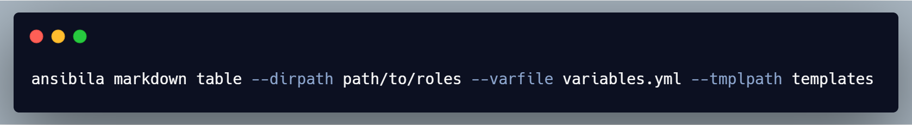

# Ansibila.go



## What is Ansibila.go

Generate documentation from Ansible roles in various output formats.

## Installation

Stable binaries are also available on the [releases] page. To install, download the binary for your platform from "Assets" and place this into your `$PATH`:

```bash
curl -Lo ./ansibila.tar.gz https://github.com/michaelact/ansibila/releases/download/v0.1.0/ansibila-v0.1.0-$(uname)-amd64.tar.gz
tar -xzf ansibila.tar.gz
chmod +x Ansibila.go
mv Ansibila.go /usr/local/ansibila
```

## Usage

### Using docker

Ansibila can be run as a container by mounting a directory with roles
directory in it and run the following command:

```bash
docker run --rm --volume "$(pwd):/ansibila" -u $(id -u) docker.io/michaelact/ansibila:0.1.0 markdown table --dirpath /ansibila/path/to/roles --varfile variables.yml --tmplpath templates
```

If `output.file` is not enabled for this module, generated output can be redirected
back to a file:

```bash
docker run --rm --volume "$(pwd):/ansibila" -u $(id -u) docker.io/michaelact/ansibila:0.1.0 markdown table --dirpath /ansibila/path/to/roles --varfile variables.yml --tmplpath templates > doc.md
```

**NOTE:** Docker tag `latest` refers to _latest_ stable released version and `edge`
refers to HEAD of `main` at any given point in time.

## Content Template

Generated content can be customized further away with `content` in configuration.
If the `content` is empty the default order of sections is used.

Compatible formatters for customized content are `markdown`. 

`content` is a Go template with following additional variables:

- `{{ .Metadata }}`
- `{{ .Modules }}`
- `{{ .Variables }}`
- `{{ .Playbook }}`
- `{{ .License }}`

These variables are the generated output of individual sections in the selected
formatter. For example `{{ .Variables }}` is Markdown Table representation of _variables.yml_
when formatter is set to `markdown table`.

## [Click here to see an example of the documentation generated from Ansibila](https://gist.github.com/michaelact/7a21871c11b561dc2b78e569da819557)

## Community

- Discuss Ansibila.go on [Telegram]

## License

MIT License - Copyright (c) 2021 The hateus Author.
